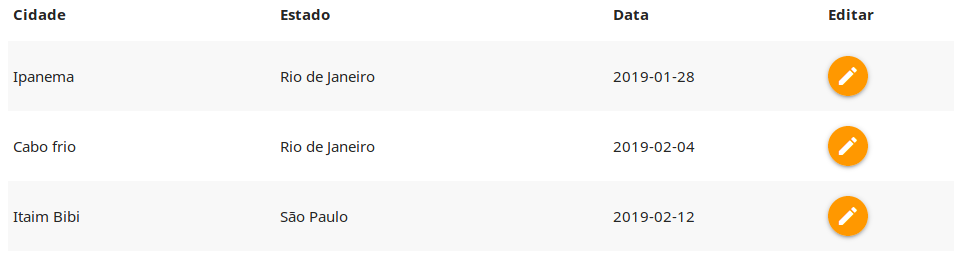
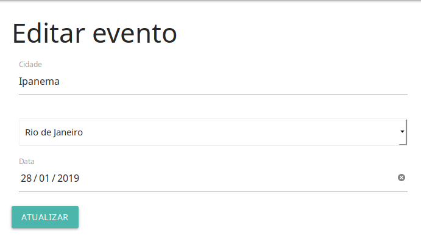
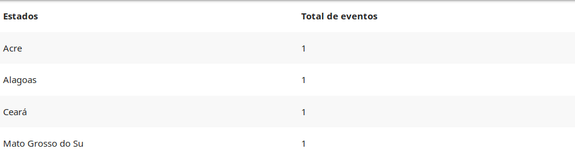

# WebAgro


## Getting Started

These instructions will get you a copy of the project up and running on your local machine for development and testing purposes.

### Prerequisites

What things you need to install the software?

```
* Localhost
* Phpmyadmin
* Code editor
* Browser
```

### Project Tree

```
├── acoes
│   ├── atualiza.php
│   ├── conexaobanco.php
│   └── criar.php
├── .buildpacks
├── css
│   ├── materialize.css
│   ├── materialize.min.css
│   └── style.css
├── editar.php
├── .git
│   ├── branches
│   ├── COMMIT_EDITMSG
│   ├── config
│   ├── description
│   ├── HEAD
│   ├── hooks
│   │   ├── applypatch-msg.sample
│   │   ├── commit-msg.sample
│   │   ├── fsmonitor-watchman.sample
│   │   ├── post-update.sample
│   │   ├── pre-applypatch.sample
│   │   ├── pre-commit.sample
│   │   ├── prepare-commit-msg.sample
│   │   ├── pre-push.sample
│   │   ├── pre-rebase.sample
│   │   ├── pre-receive.sample
│   │   └── update.sample
│   ├── index
│   ├── info
│   │   └── exclude
│   ├── logs
│   │   ├── HEAD
│   │   └── refs
│   │       ├── heads
│   │       │   └── master
│   │       └── remotes
│   │           ├── heroku
│   │           │   └── master
│   │           └── origin
│   │               └── master
|   │
│   ├── packed-refs
│   └── refs
│       ├── heads
│       │   └── master
│       ├── remotes
│       │   ├── heroku
│       │   │   └── master
│       │   └── origin
│       │       └── master
│       └── tags
├── img
│   ├── 1.png
│   ├── 2.png
│   ├── 3.png
│   └── 4.png
├── index.php
├── js
│   ├── materialize.js
│   ├── materialize.min.js
│   └── myjs.js
├── layout
│   ├── cabecalho.html
│   ├── mensagem.php
│   └── rodape.html
├── listagem.php
├── Procfile
├── README.md
└── sumario.php

```

### Installing

```
* Clone this repository - (git@github.com:RodrigoBLima/WebAgro-Events.git)
* Execute this repository in Umbler - (http://webagrotec-com.umbler.net/)
* Download the .zip in - (https://github.com/RodrigoBLima/WebAgro-Events/tree/49508017fd78928a0dfd3237b074a0dc391cf56f)

```


## Running the tests

    Step One, login in the plataform

    ```
    Email : adminwebagro2019
    Password : webagrotech@gmail.com"

    ```


    Step two, create a new event


    Step three, view event created


    Step four, edit one event


    Step five, view te summary of events


## Built With

* [Materialize](https://materializecss.com/getting-started.html) - The web framework used
* [Apache](https://www.apache.org/) - Dependency Management

## Versioning

For the versions available, see the [My repository](https://github.com/RodrigoBLima).


## Author

* **Rodrigo Barbosa** - *Initial Work* - [RodrigoBLima](https://github.com/RodrigoBLima)

## License

This project does not have any type of license for use.
