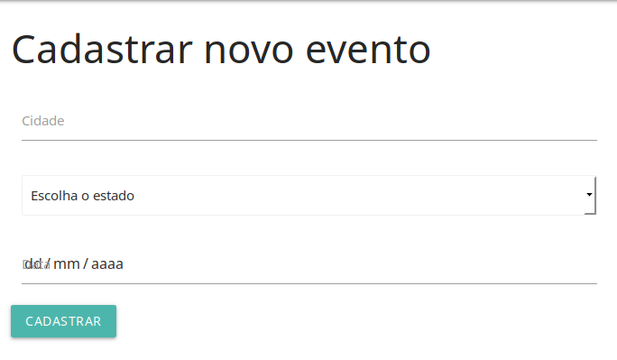

# WebAgro


## Getting Started

These instructions will get you a copy of the project up and running on your local machine for development and testing purposes. 

### Prerequisites

What things you need to install the software?

```
* Localhost
* Phpmyadmin
* Code editor
* Browser
```

### Installing

```
* Clone this repository - (git@github.com:RodrigoBLima/WebAgro-Events.git)
* Execute this repository in Heroku - (Link Heroku)
* Download the .zip in - (https://github.com/RodrigoBLima/WebAgro-Events/tree/49508017fd78928a0dfd3237b074a0dc391cf56f)

```


## Running the tests

```Step one, create a new event```


```Step two, view event created```
 

```Step three, edit one event```


```Step four, view te summary of events```


## Built With

* [Materialize](https://materializecss.com/getting-started.html) - The web framework used
* [Apache](https://www.apache.org/) - Dependency Management

## Versioning
 
For the versions available, see the [My repository](https://github.com/RodrigoBLima). 


## Author

* **Rodrigo Barbosa** - *Initial Work* - [RodrigoBLima](https://github.com/RodrigoBLima)

## License

This project does not have any type of license for use.


